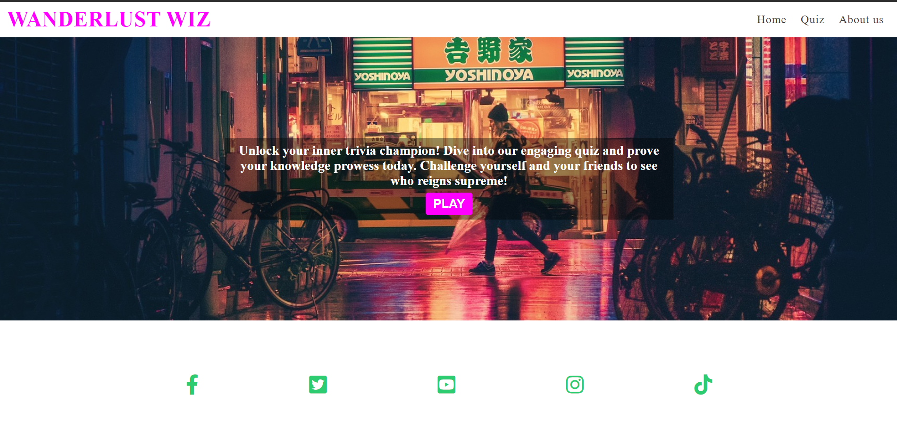

Welcome to Wanderlust Wiz website!

# Wanderlust Wiz
 Wanderlust Wiz is a captivating quiz website designed to ignite the wanderlust in every traveler's heart. Our platform intende to offer a diverse range of travel-themed quizzes that will transport you to exotic destinations, test your travel knowledge, and help you discover your inner travel personality. Whether you're a seasoned globetrotter or a novice explorer, Wanderlust Wiz is your passport to an exciting world of travel trivia and adventure. Join us on this virtual journey, explore the world, and challenge your wanderlust with our fun and informative quizzes!

 

# Creator
Code Institute
Student: Marcia Patricia Frizen
JavaScript project
Year 2023

# Features
The application intends to attract users to play quizzes online through a wide array of engaging features designed to enhance their quiz-taking experience. These features include:

# Existing Features
 Our quiz is designed to be interactive and visually appealing, featuring stunning images and multimedia elements that immerse users in the world of travel.

# Navigation Bar
The navigation bar is featured on all four pages, with the Quiz name "Wanderlust WIz" on the left corner with the logo and links to other pages of the website on the right. The fully responsive navigation bar includes links to the Logo, Home page, Quiz page, About us and page and is identical on each page to allow for easy navigation.

The navbar will allow the user to easily navigate from page to page across all devices without having to revert back to the previous page via the ‘back’ button.

* Responsive Design: Our website features a responsive design that adapts seamlessly to various screen sizes, from desktop monitors to tablets and smartphones. This means that no matter what device you're using, the navbar remains accessible and user-friendly.

* Clear Menu Structure: The navbar prominently displays a clear and intuitive menu structure, making it easy for users to find their way around the website. It includes options such as "Home," "Quizzes," "Categories," "Leaderboards," "Profile," and more, ensuring that users can access their desired content with just a click.

* Mobile-Friendly Navigation: On smaller screens, such as smartphones, the navbar may transform into a collapsible menu, accessible via a hamburger icon. This streamlined mobile navigation ensures a clutter-free and user-friendly experience on mobile devices.

* Consistent Layout: The navbar maintains a consistent layout across all pages of the website, helping users feel confident in their ability to navigate without confusion.

# Landing Page Image
1. The landing page in the header section includes h1 heading.
2. Welcoming message.
3. Image to grab user's attention extracted from pexels.com.
4. There is also a call to action button to Play redirecting to Quiz page.

 

# The Footer
The footer help users with a consistent point of reference/contact. The footer contains a copyright notice, link to social media icons (using font awesome icons). The link to social media redirects to a the respective social media websites once clicked.

 

# Quiz Page
On the Quiz page, users can explore a variety of questions related to travel and places and must choose the correct answers within 60-seconds for 10 questions.

First, the user will receive a set of instructions to follow.

 

After reading all instructions the user will START QUIZ.

 

The user will see a question displayed and four answers to select the correct response. As soon as the question is answered, there will be a check for correct and incorrect responses, with the count displayed. If the user clicks on the wrong response, the button and background turn red; whereas, if the user selects the correct response, both the background and button turn green.

Ultimately, the user will receive a concluding message along with the opportunity to make another attempt.

*Great Performance :O)
*PlayerPeformance >= 70
*Good Performance ;)
*PlayerPeformance >= 50
*Only Good
*Poor performance :(

 

# About us page

# Non-Existing Features
# Testing