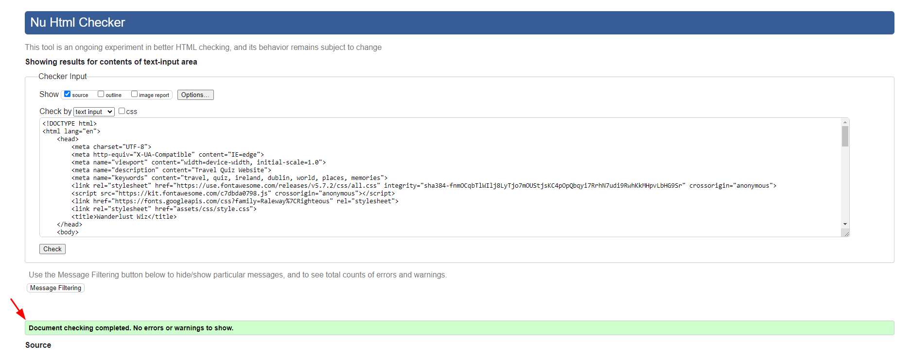

Welcome to Wanderlust Wiz website!

# WanderlustWiz
 Wanderlust Wiz is a captivating quiz website designed to ignite the wanderlust in every traveler's heart. Our platform intende to offer a diverse range of travel-themed quizzes that will transport you to exotic destinations, test your travel knowledge, and help you discover your inner travel personality. Whether you're a seasoned globetrotter or a novice explorer, Wanderlust Wiz is your passport to an exciting world of travel trivia and adventure. Join us on this virtual journey, explore the world, and challenge your wanderlust with our fun and informative quizzes!

# Creator
- Code Institute
- Student: Marcia Frizen
- JavaScript project
- Year 2023
  
# Table of contents

[Table of Contents](#table-of-contents)
- [WanderlustWiz](#wanderlustwiz)
- [Creator](#creator)
- [Table of contents](#table-of-contents)
- [Demo](#demo)
- [Features](#features)
- [Existing Features](#existing-features)
- [Navigation Bar](#navigation-bar)
- [Landing Page Image](#landing-page-image)
- [The Footer](#the-footer)
- [Quiz Page](#quiz-page)
- [About us page](#about-us-page)
- [Future features](#future-features)
- [Technologies](#technologies)
- [Testing](#testing)
- [Bugs](#bugs)
- [Validator testing](#validator-testing)
- [HTML](#html)
  - [Index Page](#index-page)
  - [Quiz Page](#quiz-page-1)
- [CSS](#css)
- [JavaScript](#javascript)
- [Acessibility](#acessibility)
- [Deployment](#deployment)
- [Credits](#credits)
  - [Media](#media)

# Demo

 

A live demo can be found [here](https://mpaty24.github.io/WanderlustWiz/)

# Features
The application intends to attract users to play quizzes online through a wide array of engaging features designed to enhance their quiz-taking experience. These features include:

# Existing Features
 Our quiz is designed to be interactive and visually appealing, featuring stunning images and multimedia elements that immerse users in the world of travel.

# Navigation Bar
The navigation bar is featured on all four pages, with the Quiz name "Wanderlust WIz" on the left corner with the logo and links to other pages of the website on the right. The fully responsive navigation bar includes links to the Logo, Home page, Quiz page, About us and page and is identical on each page to allow for easy navigation.

The navbar will allow the user to easily navigate from page to page across all devices without having to revert back to the previous page via the ‘back’ button.

* Responsive Design: Our website features a responsive design that adapts seamlessly to various screen sizes, from desktop monitors to tablets and smartphones. This means that no matter what device you're using, the navbar remains accessible and user-friendly.

* Clear Menu Structure: The navbar prominently displays a clear and intuitive menu structure, making it easy for users to find their way around the website. It includes options such as "Home," "Quizzes," "Categories," "Leaderboards," "Profile," and more, ensuring that users can access their desired content with just a click.

* Mobile-Friendly Navigation: On smaller screens, such as smartphones, the navbar may transform into a collapsible menu, accessible via a hamburger icon. This streamlined mobile navigation ensures a clutter-free and user-friendly experience on mobile devices.

* Consistent Layout: The navbar maintains a consistent layout across all pages of the website, helping users feel confident in their ability to navigate without confusion.

# Landing Page Image
1. The landing page in the header section includes h1 heading.
2. Welcoming message.
3. Image to grab user's attention extracted from pexels.com.
4. There is also a call to action button to Play redirecting to Quiz page.

 

# The Footer
The footer help users with a consistent point of reference/contact. The footer contains a copyright notice, link to social media icons (using font awesome icons). The link to social media redirects to a the respective social media websites once clicked.

 

# Quiz Page
On the Quiz page, users can explore a variety of questions related to travel and places and must choose the correct answers within 60-seconds for 10 questions.

First, the user will receive a set of instructions to follow.

 

After reading all instructions the user will START QUIZ.

 

The user will see a question displayed and four answers to select the correct response. As soon as the question is answered, there will be a check for correct and incorrect responses, with the count displayed. If the user clicks on the wrong response, the button and background turn red; whereas, if the user selects the correct response, both the background and button turn green.

Ultimately, the user will receive a concluding message along with the opportunity to make another attempt.

*Great Performance :O)
*PlayerPeformance >= 70
*Good Performance ;)
*PlayerPeformance >= 50
*Only Good
*Poor performance :(
    

 

# About us page

About page

The About us page will display all users name, position and BIO.

 

# Future features

The objective is to systematically enhance the educational experience by creating a greater number of quiz modules categorized according to distinct subject matter and geographical regions, while also incorporating visual elements within the quiz interface.

# Technologies
1. HTML - To create the site structure
2. CSS - To style and design user friendly pages 
3. Balsamiq - To create a wireframe
   
# Testing

I conducted comprehensive testing of the website across various web browsers, including Chrome, Firefox, and Microsoft Edge. Additionally, I ensured compatibility with mobile devices, specifically testing on a Iphone XR & PRO.

I verified the site's responsiveness across different screen sizes using the developer tools' device toolbar.

# Bugs
* I enhanced text readability on the main page by increasing the opacity. This was particularly important as it overlaid a background image.

* The properties on the home page were initially unreadable due to an issue with the JavaScript script that was included unnecessarily.

* To prevent users from clicking multiple times on the same button, I disabled the option buttons upon clicking and set their attributes to 'disabled=true.

* Upon reaching the time limit, I cleared the content on the page.

* I applied an HTML formatter to improve code readability and structure.

* I mistakenly duplicated the same CSS ID twice, which is against the rule that IDs must be unique.

* In the JavaScript code, I corrected some variables that had started with uppercase letters.

* To improve the layout, I relocated the questions to the bottom of the page.

# Validator testing

Extensive testing has yielded no significant issues.

The website operates at peak efficiency, boasting a user-friendly and intuitive interface. Users can effortlessly navigate and accomplish their objectives without encountering any obstacles.

The site is fully responsive and seamlessly functions on various browsers, including Chrome, Firefox, and Safari, as well as across different screen dimensions.

# HTML
No errors were returned when passing through the official [W3C validator]

 

    

## Index Page

No errors were returned when passing through the official [W3C validator]

 

    

## Quiz Page

No errors were returned when passing through the official [W3C validator]

 

    

# CSS

 No errors were found when passing through the official [(Jigsaw) validator]

 

    

# JavaScript

# Acessibility
Acessibility has been tested on WAVE Web Accessibility Evaluation Tool and no errors or contrast errors were found.

 

 I verified the legibility and accessibility of the selected colors and fonts by subjecting them to testing.[Lighthouse DevTools]

# Deployment
Wanderlust Wiz website is deployed to GitHub pages. The deployment steps taken:

1. Access GitHub repository Wanderlus Wiz Quiz
2. Go to the Settings tab
3. From the source section drop-down menu, select the Master Branch
4. Once the master branch has been selected, the page will be automatically refreshed with a detailed ribbon display to indicate the successful deployment.
5. The live link can be found here:
   https://mpaty24.github.io/WanderlustWiz/ 

# Credits 
The icons in the footer were taken from Font Awesome.

## Media
All the pictures included on Wanderlust Wiz project are from 
https://www.pexels.com/ 